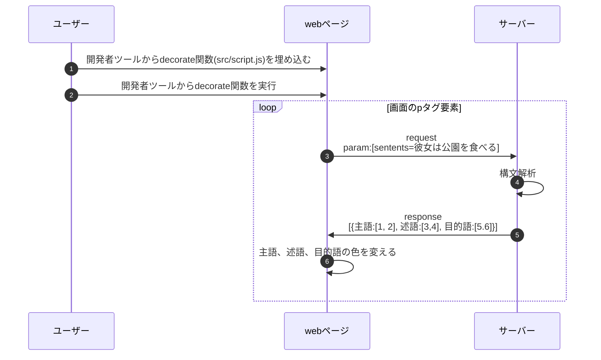
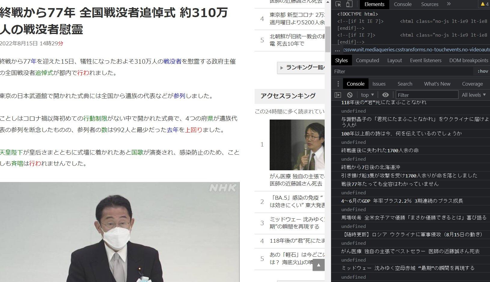

# 述語、主語、目的語に色を付けて文章を読みやすくするプログラム
日本語は述語が中心でその周りにさまざまな成分が構成されるらしい。  
https://tak-japan.com/bunkouzou/  
重要そうな成分に色を付けたら読みやすくなるのでは・・！  

## 構成図

```mermaid
sequenceDiagram
	autonumber
	ユーザー->>webページ:開発者ツールからdecorate関数(src/script.js)を埋め込む
	ユーザー->>webページ:開発者ツールからdecorate関数を実行
	loop 画面のpタグ要素
		webページ->>サーバー:request<br> param:[sentents=彼女は公園を食べる]
		サーバー->>サーバー:構文解析
		サーバー->>webページ:response <br>[{主語:[1, 2], 述語:[3,4], 目的語:[5.6]}]
		webページ->>webページ:主語、述語、目的語の色を変える	
	end
```

## 動作例

赤：述語、青：目的語、緑：主語  
読みにくい・・・
